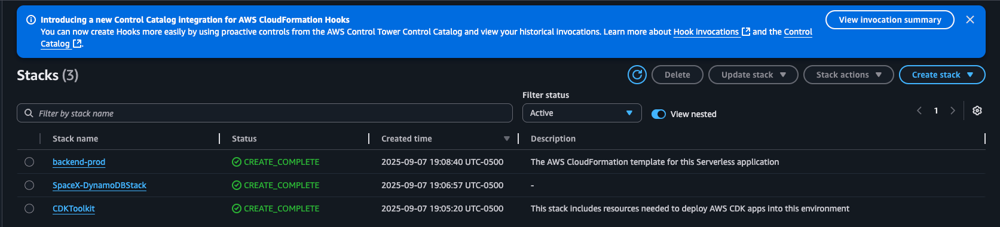

# Monorepo Space X Project

- Backend: Serverless v3.11 (Python) en `services/backend`
- Infra: AWS CDK (Python) en `infra/cdk`

## Prerequisitos

- [Node Js](https://nodejs.org/es)
- [Python](https://www.python.org/)
- Serverless Framework - `npm install -g serverless`
- [AWS CLI](https://aws.amazon.com/cli/)
- AWS CDK - `npm install -g aws-cdk`

Configura tus credenciales usando

```bash
aws configure
```

## Tecnologìas
- Python 3.11
- Backend Serveless
- AWS CDK (Python)
- Gestor de paquetes

## Scripts

- Instalaciòn de dependencias
```bash
npm install
```

- Desplegar infraestructura (CDK):
```bash
npm run cdk:bootstrap
npm run cdk:deploy
```

- Desplegar backend (Serverless):
```bash
npm run deploy:backend
```

- Probar en local:
```bash
npm run offline
```

- Actualizar infraestructura:
```bash
npm run cdk:diff
npm run cdk:deploy
```

- Eliminar backend:
```bash
npm run remove:backend
```

Preview deploy en AWS

